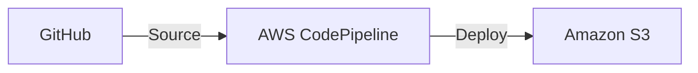

# Static Resume Site: GitHub → AWS CodePipeline → Amazon S3

This repo hosts a static resume site (`index.html`, `styles.css`). The deployment pipeline automatically publishes updates from GitHub to an S3 bucket configured for static website hosting.

## Architecture



- **Source**: GitHub repository branch (e.g., `main`).
- **Pipeline**: AWS CodePipeline with two stages: Source → Deploy.
- **Deploy**: S3 Deploy action uploads static files to your website bucket.

Optional add-ons:
- CloudFront + ACM for HTTPS and caching.
- CodeBuild stage for minification/linting/tests before deploy.

---

## Prerequisites
- AWS account with permissions to create S3, IAM, CodePipeline, and (optionally) CodeStar Connections.
- A GitHub repository containing your static site (this repo structure works out-of-the-box).
- AWS CLI v2 configured (`aws configure`).

---

## Quick Setup

1) Create two S3 buckets (one for the website, one for pipeline artifacts) and enable static website hosting.
```bash
REGION=us-west-2
WEBSITE_BUCKET=my-resume-site-website-<unique>
ARTIFACT_BUCKET=my-resume-site-artifacts-<unique>

aws s3api create-bucket --bucket "$WEBSITE_BUCKET" --region "$REGION" --create-bucket-configuration LocationConstraint="$REGION"
aws s3api create-bucket --bucket "$ARTIFACT_BUCKET" --region "$REGION" --create-bucket-configuration LocationConstraint="$REGION"
aws s3 website s3://$WEBSITE_BUCKET/ --index-document index.html --error-document index.html
```

2) Connect GitHub to AWS.
- Console → Developer Tools → Connections → Create connection → GitHub.
- Keep the Connection ARN handy.

3) Create the pipeline (2 stages: Source → Deploy) using the console.
- Console → CodePipeline → Create pipeline.
- Source: CodeStar connection (select your connection), pick repo and branch.
- Deploy: S3 deploy action → pick `WEBSITE_BUCKET`, set "Extract file before deploying" = true.
- Artifacts: use `ARTIFACT_BUCKET`.

4) Push to your branch to deploy.
- Every commit to the configured branch publishes updated `index.html`/`styles.css` to S3.
- Open the S3 Website endpoint (or your CloudFront domain, if added).

Notes:
- If serving directly from S3, you may need a public-read bucket policy (or prefer CloudFront with an Origin Access Control to keep the bucket private).
- Prefer least-privilege IAM; the console-created roles are sufficient for this minimal setup.

---

## Repository Layout
```
resume/
├─ index.html
├─ styles.css
├─ .gitignore
└─ README.md (this file)
```

If you add an asset folder, keep paths relative so S3 can serve them directly.

---

## Maintenance
- **Content updates**: Commit to the tracked branch; the pipeline redeploys automatically.
- **Access keys**: Prefer CodeStar Connections over classic GitHub OAuth tokens. Rotate if needed.
- **Bucket hygiene**: Enable S3 versioning and lifecycle rules to manage old objects and artifacts.
- **Security**: Prefer CloudFront with an Origin Access Control for public sites; keep the website bucket private.
- **Monitoring**: Enable CodePipeline notifications (SNS) and set up CloudWatch alarms for failures.

---

## Troubleshooting
- **Pipeline stuck at Source**: Verify CodeStar Connection status is "Available" and branch/repo values match.
- **Deploy fails with AccessDenied**: Check pipeline role permissions for the website bucket and artifact bucket.
- **Files not updating**: Ensure `Extract: true` in the S3 Deploy action and that your artifacts contain the root files (not nested in a folder).
- **403 on website**:
  - If serving directly from S3, confirm public-read policy and that objects inherit it.
  - If using CloudFront, invalidate the cache or enable versioned filenames.
- **MIME types incorrect**: Ensure files upload with correct `Content-Type`. The S3 Deploy action sets common types automatically; for custom assets consider a build step.
- **Index not found**: Confirm S3 Static Website Hosting is enabled and `index.html` exists at bucket root.

---

## Extensions (Optional)
- Add a CodeBuild stage for linting/minification:
  - Include a `buildspec.yml` that outputs artifacts to `dist/` and set Deploy to use that artifact.
- Add CloudFront + ACM for HTTPS and better performance. Point your DNS (Route 53) to the distribution and keep the S3 bucket private behind the distribution.

---

## Useful Commands
Manual upload (for testing):
```bash
aws s3 sync . s3://$WEBSITE_BUCKET --exclude ".git/*" --exclude "README.md" --delete
```

Get the website URL:
```bash
aws s3api get-bucket-website --bucket $WEBSITE_BUCKET
```

---

## License
This project is provided as-is for educational purposes. Replace placeholder ARNs, bucket names, and IDs with your own.

