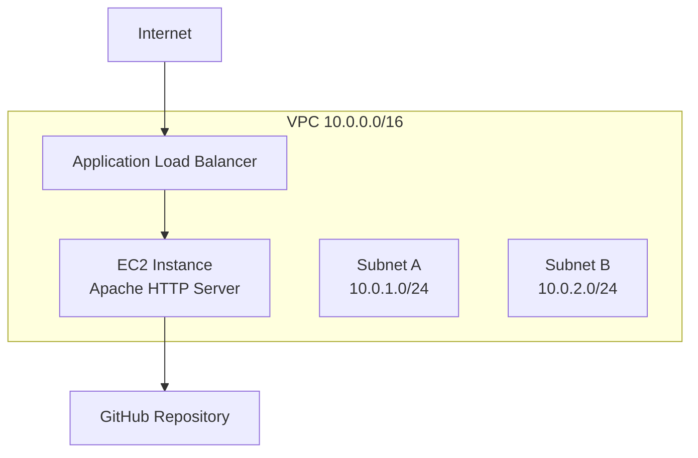

# Resume Website: EC2 + Application Load Balancer on AWS

This repository contains a CloudFormation template that deploys a resume website on an EC2 instance behind an Application Load Balancer (ALB). The EC2 instance automatically clones your GitHub repository and serves the static HTML/CSS files via Apache HTTP Server.

## Architecture



**Infrastructure Components:**
- **VPC**: Custom VPC with DNS support enabled
- **Subnets**: Two public subnets across different availability zones for high availability
- **Internet Gateway**: Enables internet access for the VPC
- **Route Table**: Routes traffic from subnets to the internet gateway
- **Security Group**: Allows HTTP (port 80) and SSH (port 22) traffic
- **EC2 Instance**: Amazon Linux 2 instance running Apache HTTP Server
- **Application Load Balancer**: Distributes traffic across instances (ready for scaling)
- **Target Group**: Health checks and routes traffic to the EC2 instance
- **Listener**: Listens on port 80 and forwards to the target group

---

## Prerequisites

- AWS account with permissions to create VPC, EC2, ELB, and related resources
- An existing EC2 Key Pair in your AWS region (for SSH access)
- A GitHub repository containing your static site files (`index.html`, `styles.css`, etc.)
- AWS CLI v2 configured (`aws configure`)
- CloudFormation template file (e.g., `template.yaml`)

---

## Quick Setup

### 1. Prepare Your GitHub Repository

Ensure your GitHub repository is public or accessible, and contains your resume website files:
- `index.html`
- `styles.css` (or other static assets)

### 2. Deploy the CloudFormation Stack

Using AWS CLI:
```bash
aws cloudformation create-stack \
  --stack-name resume-website \
  --template-body file://template.yaml \
  --parameters \
    ParameterKey=KeyName,ParameterValue=your-key-pair-name \
    ParameterKey=InstanceType,ParameterValue=t2.micro \
    ParameterKey=GithubRepo,ParameterValue=https://github.com/username/resume-website.git \
  --region us-west-2
```

Or using the AWS Console:
1. Navigate to CloudFormation → Create stack
2. Upload the template file
3. Specify parameters:
   - **KeyName**: Your existing EC2 Key Pair name
   - **InstanceType**: `t2.micro`, `t2.small`, or `t3.micro` (default: `t2.micro`)
   - **GithubRepo**: URL of your GitHub repository (default: `https://github.com/username/resume-website.git`)
4. Review and create the stack

### 3. Wait for Stack Creation

Monitor the stack creation:
```bash
aws cloudformation describe-stacks --stack-name resume-website --region us-west-2
```

The stack typically takes 3-5 minutes to create all resources.

### 4. Access Your Website

Once the stack is created, get the website URL from the stack outputs:
```bash
aws cloudformation describe-stacks \
  --stack-name resume-website \
  --query 'Stacks[0].Outputs[?OutputKey==`WebsiteURL`].OutputValue' \
  --output text \
  --region us-west-2
```

Or view it in the CloudFormation console under the "Outputs" tab. The URL will look like:
```
http://resumealb-xxxxxxxxxx.us-west-2.elb.amazonaws.com
```

---

## Template Parameters

| Parameter | Type | Default | Description |
|-----------|------|---------|-------------|
| `KeyName` | AWS::EC2::KeyPair::KeyName | *Required* | Name of an existing EC2 KeyPair to enable SSH access |
| `InstanceType` | String | `t2.micro` | EC2 instance type (`t2.micro`, `t2.small`, or `t3.micro`) |
| `GithubRepo` | String | `https://github.com/username/resume-website.git` | GitHub repo URL containing your HTML/CSS files |

---

## How It Works

1. **EC2 Instance Launch**: The instance boots with Amazon Linux 2
2. **User Data Script**: On first boot, the instance:
   - Updates system packages
   - Installs Apache HTTP Server (`httpd`) and Git
   - Starts and enables the Apache service
   - Clones your GitHub repository to `/var/www/html`
   - Restarts Apache to serve the files
3. **Load Balancer**: The ALB distributes traffic and performs health checks
4. **Target Group**: Routes traffic to the EC2 instance on port 80

---

## Repository Layout

```
resume-cf/
├─ template.yaml          # CloudFormation template
├─ index.html            # Your resume HTML
├─ styles.css            # Your CSS styles
├─ .gitignore
└─ README.md             # This file
```

---

## Updating Your Website

To update the website content:

1. **Update GitHub Repository**: Push changes to your GitHub repository
2. **SSH into EC2 Instance**: 
   ```bash
   ssh -i your-key.pem ec2-user@<EC2-PUBLIC-IP>
   ```
3. **Pull Latest Changes**:
   ```bash
   cd /var/www/html
   git pull
   sudo systemctl restart httpd
   ```

Alternatively, you can update the stack with a new GitHub repository URL:
```bash
aws cloudformation update-stack \
  --stack-name resume-website \
  --template-body file://template.yaml \
  --parameters \
    ParameterKey=KeyName,ParameterValue=your-key-pair-name \
    ParameterKey=InstanceType,ParameterValue=t2.micro \
    ParameterKey=GithubRepo,ParameterValue=https://github.com/username/new-repo.git \
  --region us-west-2
```

---

## Maintenance

- **Instance Health**: The ALB performs health checks on `/` every 30 seconds
- **Scaling**: The template is ready for Auto Scaling Groups (add targets to the Target Group)
- **Security**: 
  - SSH access is open to the internet (0.0.0.0/0) - consider restricting to your IP
  - HTTP traffic is open - consider adding HTTPS with ACM certificate
- **Monitoring**: Enable CloudWatch alarms for instance health and ALB metrics
- **Cost Optimization**: Use `t2.micro` for development/testing (eligible for free tier)

---

## Troubleshooting

- **Stack creation fails**: 
  - Verify the Key Pair name exists in the region
  - Check that the AMI ID (`ami-0892d3c7ee96c0bf7`) is valid for your region (this is for `us-west-2`)
  - Ensure you have sufficient service quotas for VPC, EC2, and ELB resources

- **Website not accessible**:
  - Wait 3-5 minutes after stack creation for the instance to finish initialization
  - Check the EC2 instance status and system logs
  - Verify the security group allows HTTP traffic (port 80)
  - Check the ALB target group health status

- **Git clone fails**:
  - Verify the GitHub repository URL is correct and accessible
  - Ensure the repository is public or the instance has access credentials
  - Check EC2 instance logs: `sudo cat /var/log/cloud-init-output.log`

- **Instance not responding to health checks**:
  - SSH into the instance and verify Apache is running: `sudo systemctl status httpd`
  - Check that files exist in `/var/www/html`
  - Verify the security group allows traffic from the ALB security group

---

## Extensions (Optional)

- **HTTPS**: Add an ACM certificate and update the listener to use HTTPS (port 443)
- **Auto Scaling**: Create an Auto Scaling Group to replace the single EC2 instance
- **Multiple Instances**: Add more EC2 instances to the target group for high availability
- **Custom Domain**: Point a Route 53 hosted zone to the ALB DNS name
- **CloudWatch Logs**: Configure Apache logs to be sent to CloudWatch
- **WAF**: Add AWS WAF to protect against common web exploits

---

## Useful Commands

Get the website URL:
```bash
aws cloudformation describe-stacks \
  --stack-name resume-website \
  --query 'Stacks[0].Outputs[?OutputKey==`WebsiteURL`].OutputValue' \
  --output text \
  --region us-west-2
```

SSH into the EC2 instance:
```bash
# Get the instance public IP
INSTANCE_IP=$(aws ec2 describe-instances \
  --filters "Name=tag:Name,Values=ResumeServer" \
  --query 'Reservations[0].Instances[0].PublicIpAddress' \
  --output text \
  --region us-west-2)

ssh -i your-key.pem ec2-user@$INSTANCE_IP
```

View stack resources:
```bash
aws cloudformation describe-stack-resources --stack-name resume-website --region us-west-2
```

Delete the stack:
```bash
aws cloudformation delete-stack --stack-name resume-website --region us-west-2
```

---

## Important Notes

- **AMI Region**: The template uses AMI ID `ami-0892d3c7ee96c0bf7` which is for `us-west-2`. Update this for other regions.
- **Cost**: Running an EC2 instance and ALB incurs charges. Stop/delete the stack when not in use.
- **Security**: The current setup allows SSH from anywhere. Consider restricting SSH access to your IP address for production use.

---

## License

This project is provided as-is for educational purposes. Replace placeholder values (AMI IDs, repository URLs) with your own.

